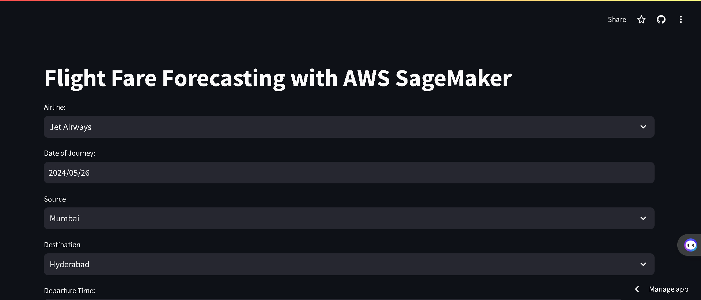
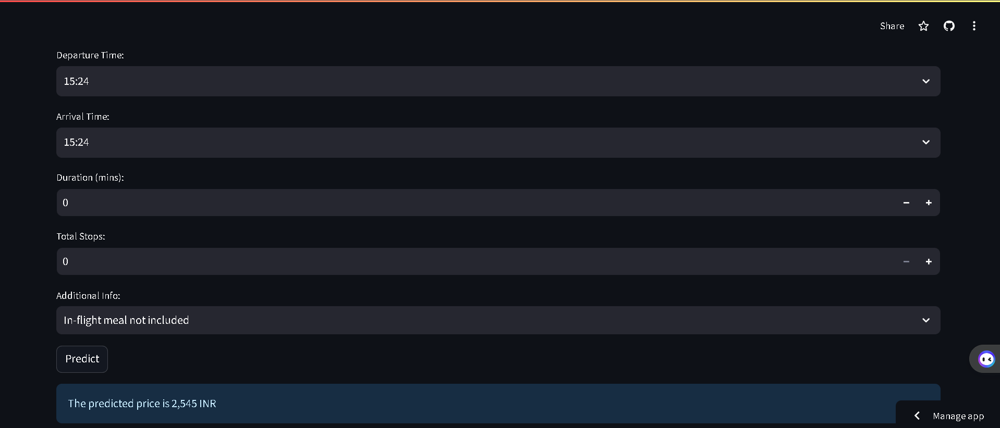

# Flight Price Prediction using AWS SageMaker

## Project Overview

This project aims to predict flight prices using machine learning techniques implemented on AWS SageMaker. The project includes comprehensive steps such as data collection, data cleaning, exploratory data analysis (EDA), feature engineering, model training, hyperparameter tuning, and deployment. A web application is also developed using Streamlit to allow users to input flight details and receive price predictions.

## Table of Contents

1. [Relevant Links](#relevant-links)
2. [Project Goals and Objectives](#project-goals-and-objectives)
3. [Data Collection](#data-collection)
4. [Data Cleaning and Preprocessing](#data-cleaning-and-preprocessing)
5. [Exploratory Data Analysis (EDA)](#exploratory-data-analysis-eda)
6. [Feature Engineering](#feature-engineering)
7. [Model Training and Deployment](#model-training-and-deployment)
8. [Snapshots](#snapshots)
9. [Project Architecture](#project-architecture)
10. [Mind Map](#mind-map)


## Relevant Links

- [Web Application](https://flight-fare-forecasting-with-aws-sagemaker-fajtmtqbjbumxievoq9.streamlit.app/)
- [GitHub](https://github.com/sahiltambe/Flight-Fare-Forecasting-with-AWS-SageMaker/)
- [LinkedIn](https://www.linkedin.com/in/sahiltambe13//)

## Project Goals and Objectives

The primary objective of this project is to build a predictive model that can estimate flight prices based on various input features such as departure date, airline, and destination. The project aims to:

- Utilize AWS SageMaker for scalable model training and deployment.
- Implement robust data cleaning and preprocessing techniques.
- Conduct thorough exploratory data analysis (EDA).
- Engineer meaningful features to enhance model performance.
- Optimize model performance through hyperparameter tuning.
- Develop a user-friendly web application using Streamlit for flight price predictions.

### Project Architecture


## Data Collection

### Data Collection Strategies

Data was collected from multiple sources, including airline APIs and web scraping. The dataset includes attributes such as:

- Airline
- Date of Journey
- Source
- Destination
- Route
- Duration
- Total Stops
- Additional Info

### Challenges in Data Collection

Some challenges faced during data collection included handling inconsistent data formats and missing values. These issues were addressed through various data cleaning techniques.

## Data Cleaning and Preprocessing

### Data Cleaning Techniques

- **Identifying and Handling Missing Values**: Used methods like mean imputation and mode imputation.
- **Removing Duplicates**: Ensured no duplicate entries existed in the dataset.
- **Standardization**: Standardized categorical variables and ensured consistency in formats.

### Handling Outliers

Outliers were detected using techniques like the IQR method and handled appropriately to avoid skewing the data.

## Exploratory Data Analysis (EDA)

### Understanding Skewness

Analyzed data distributions to identify skewness and used visualization tools to better understand data patterns.

### Correlation Analysis

Conducted correlation analysis to identify relationships between different variables.

### Visualization Techniques

Used tools like Matplotlib and Seaborn for data visualization to uncover insights and patterns in the dataset.

## Feature Engineering

### Feature Union and Column Transformer

Combined multiple transformation steps to create a unified feature set using techniques like Feature Union and ColumnTransformer.

### One-Hot Encoding and Rare Label Handling

Applied one-hot encoding to categorical variables and handled rare labels by grouping them.

### Custom Transformations

Implemented custom transformations using Python classes wrapped inside function transformers.

### Scaling and Normalization

Applied MinMax scaling to bring numeric features to a common scale.

## Model Training and Deployment

### Hyperparameter Tuning with Optuna

Set up and optimized hyperparameters using Optuna to enhance model performance.

### Model Training on AWS SageMaker

Configured the training environment and ran the model on AWS SageMaker, utilizing its scalable infrastructure.

### Building a Streamlit Web Application

Developed a user-friendly web application using Streamlit, allowing users to input flight details and receive predictions.

### Troubleshooting and Debugging

Addressed common code errors, path issues, and ensured smooth deployment and monitoring using AWS SageMaker tools.

## Snapshots





## Mind Map

```mermaid
mindmap
  root((Flight Price Prediction Project))
    Data Collection
      Data Sources
      Data Attributes
      Collection Challenges
    Data Cleaning and Preprocessing
      Missing Values
      Outlier Detection
      Standardization
    Exploratory Data Analysis
      Skewness Analysis
      Correlation Analysis
      Data Visualization
    Feature Engineering
      One-Hot Encoding
      Custom Transformations
      Scaling and Normalization
    Model Training and Deployment
      Hyperparameter Tuning
      Model Training
      Streamlit App
      Troubleshooting
